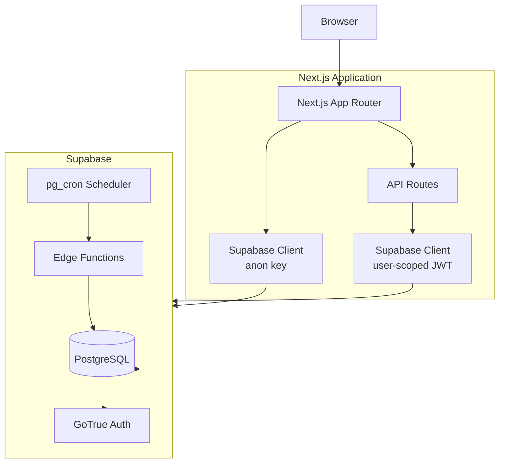
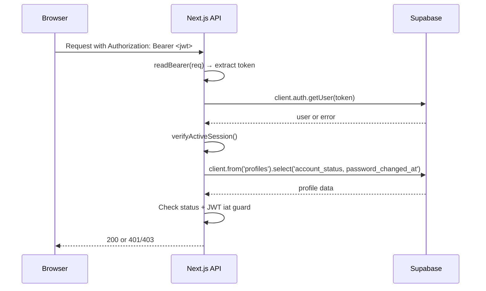
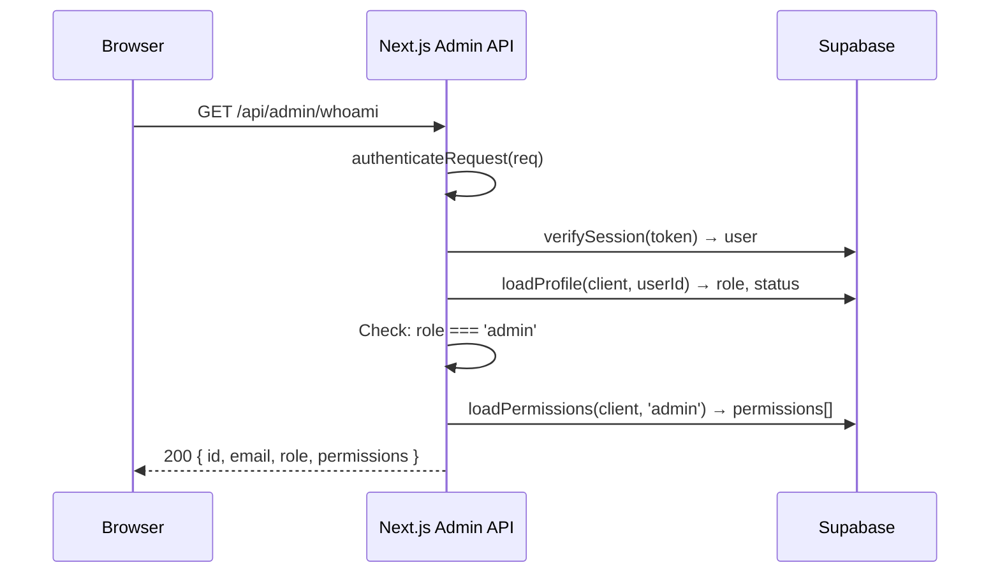
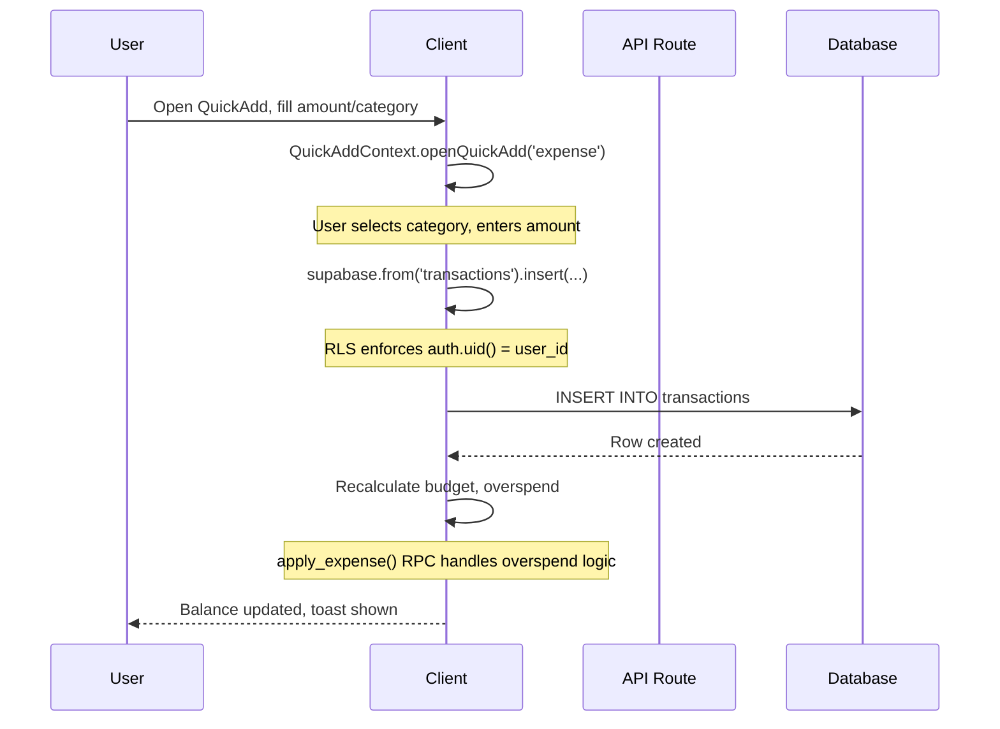

# FinSight — Architecture

## High-Level Architecture



## Frontend Architecture

### App Router Structure

Every page is a `"use client"` component. The root layout is a server component that reads `headers()` for CSP nonce injection, which forces all routes into dynamic rendering.

```
src/app/
├── layout.tsx              Root layout (server, nonce injection)
├── page.tsx                Root redirector (→ /dashboard or /login)
├── globals.css             Theme system + Tailwind
├── login/                  Login page
├── register/               Registration page
├── verify/                 OTP verification page
├── forgot-password/        Password reset request
├── reset-password/         Password reset completion
├── dashboard/              Main dashboard
├── transactions/           Transaction list
├── analytics/              Charts and breakdowns
├── budgets/                Budget management
├── goals/                  Financial goals
├── savings/                Savings balance
├── bills/                  Bill tracking
├── recurring/              Recurring transactions
├── lend/                   Borrow & lend
├── cards/                  Credit card overview
├── calendar/               Monthly calendar
├── insights/               AI insights
├── notifications/          In-app inbox
├── profile/                User profile
├── settings/               App settings
├── settings/categories/    Category browser
└── admin/                  Admin console (12 sub-pages)
```

### Component Architecture

```
src/components/
├── ui/                     Reusable primitives
│   ├── Button.tsx
│   ├── BottomSheet.tsx
│   ├── GlassCard.tsx
│   ├── Icons.tsx
│   ├── Progress.tsx
│   ├── SegmentedControl.tsx
│   ├── Skeleton.tsx
│   ├── ToastProvider.tsx
│   ├── Toggle.tsx
│   └── BalanceVisibility.tsx
├── admin/                  Admin-specific components
│   ├── AdminPage.tsx
│   ├── AdminShell.tsx
│   ├── ConfirmDialog.tsx
│   └── ui.tsx
├── AppShell.tsx            Authenticated app wrapper (nav, sidebar)
├── AuthShell.tsx           Auth page layout (centered card)
├── ThemeProvider.tsx        Theme sync (dark/light/system)
├── QuickAddContext.tsx      Quick-add sheet context
├── QuickAddSheet.tsx        Quick-add transaction sheet
├── FloatingActionButton.tsx
├── TransactionRow.tsx       Transaction list item
├── TransactionDetailSheet.tsx
├── TransactionsFilterSheet.tsx
├── TransactionSortControl.tsx
├── TrendChart.tsx           Expense trend chart
├── GoalCard.tsx             Goal display card
├── GoalFormSheet.tsx        Goal create/edit
├── GoalDetailsSheet.tsx     Goal detail view
├── GoalsSection.tsx         Goals section on dashboard
├── ContributionSheet.tsx    Goal contribution form
├── BillFormSheet.tsx        Bill create/edit
├── RecurringFormSheet.tsx   Recurring rule create/edit
├── BirthdayGreeting.tsx     Birthday celebration card
├── BroadcastInbox.tsx       Notification inbox
├── NotificationCenter.tsx   Notification center
├── NotificationPermissionCard.tsx
├── AIInsights.tsx           AI insights card
├── SmartHints.tsx           Contextual hints
├── InstallAppPrompt.tsx     PWA install prompt
├── StartupSplash.tsx        Cold-start splash
├── OfflineIndicator.tsx     Offline status
├── PasswordStrength.tsx     Password strength meter
└── PageHeader.tsx           Reusable page header
```

### State Management

- **No global state library** — state is managed via React hooks and context
- `QuickAddContext` — provides `openQuickAdd(mode)` across the app
- `ThemeProvider` — syncs theme preference with DOM
- `ToastProvider` — toast notification system
- `usePageData(userId)` — shared hook for profile + transactions + budget data
- `useSettings()` — reads/writes settings to localStorage
- `useCategories()` — fetches and caches category tree
- `useAdminAuth()` — client-side admin auth state
- `useAdminData()` — admin data fetching with maintenance polling

### Data Fetching

All data fetching is client-side via the Supabase browser client:

1. Page component calls `supabase.auth.getSession()` to verify authentication
2. Data hooks (`usePageData`, `listTransactions`, etc.) fetch from Supabase using the user's JWT
3. RLS ensures each query only returns the user's own rows
4. API routes are used only for operations requiring server-side logic (AI, password reset, admin)

## Backend Architecture

### API Route Structure

```
src/app/api/
├── health/route.ts                GET /api/health
├── app/status/route.ts            GET /api/app/status
├── admin/[[...slug]]/route.ts     * /api/admin/* (catch-all)
└── v1/
    ├── ai/insights/route.ts       POST /api/v1/ai/insights
    ├── auth/
    │   ├── forgot-password/       POST
    │   ├── reset-password/        POST
    │   └── change-password/       POST
    ├── bills/[[...slug]]/route.ts GET POST PATCH DELETE
    ├── categories/route.ts        GET
    ├── categories/[id]/route.ts   DELETE (405 stub)
    ├── goals/[[...slug]]/route.ts GET POST PATCH DELETE
    ├── health/
    │   ├── live/route.ts          GET
    │   └── ready/route.ts         GET
    ├── notifications/[[...slug]]  GET POST
    ├── recurring/[[...slug]]/route.ts GET POST PATCH DELETE
    └── transactions/route.ts      GET
```

### Authentication Flow



### Admin Authorization Flow



### Error Handling

- API routes use `handleRoute()` wrapper which catches `ApiError` instances and returns structured JSON
- Unexpected errors are logged via `logger.error()` and returned as generic 500 responses
- Stack traces, SQL errors, and internal paths are never exposed to clients
- `logger.err()` serializer strips sensitive fields in production

### Logging

- Structured JSON logger (`src/lib/logger.ts`) emitting one JSON object per line
- Levels: `info`, `warn`, `error`
- Components: `admin-auth`, `admin-api`, `health`, `user-api`
- Events include: `missing_token`, `invalid_session`, `not_admin`, `access_denied`, `unhandled_error`

### Rate Limiting

In-memory sliding-window rate limiters (`src/lib/rateLimit.ts`):

| Limiter | Budget | Window | Key |
|---|---|---|---|
| `passwordResetRateLimiter` | 5/hr | 1 hour | IP + email |
| `passwordResetConsumeLimiter` | 10/hr | 1 hour | IP |
| `aiUserLimiter` | 12/hr | 1 hour | User ID |
| `aiIpLimiter` | 30/hr | 1 hour | IP |
| `adminAuthIpLimiter` | 30/15min | 15 min | IP |
| `adminAuthUserLimiter` | 15/15min | 15 min | User ID |
| `adminPasswordResetRateLimiter` | 10/hr | 1 hour | IP + email |

All budgets are tunable via `RATE_LIMIT_*` environment variables.

## Data Flow: Transaction Creation


