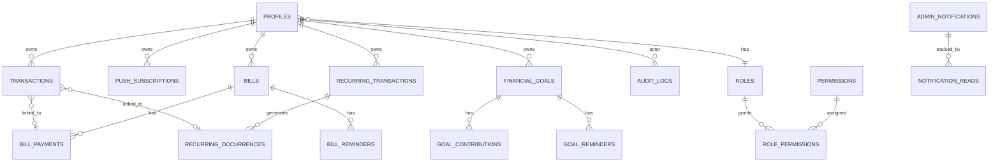

# FinSight — Database

## Overview

FinSight uses Supabase (PostgreSQL) with Row Level Security enforced on every table. The database is the primary security boundary — application code delegates data access to RLS policies.

## Tables

### profiles

User account data and live balances.

| Column | Type | Constraints |
|---|---|---|
| `id` | uuid | PK, FK → `auth.users(id)` ON DELETE CASCADE |
| `email` | text | |
| `full_name` | text | |
| `monthly_budget` | numeric(12,2) | NOT NULL DEFAULT 0 |
| `salary_balance` | numeric(12,2) | NOT NULL DEFAULT 0, CHECK ≥ 0 |
| `savings_balance` | numeric(12,2) | NOT NULL DEFAULT 0, CHECK ≥ 0 |
| `date_of_birth` | date | NULL |
| `created_at` | timestamptz | NOT NULL DEFAULT now() |
| `role` | text | NOT NULL DEFAULT 'user', FK → `roles(name)` |
| `account_status` | text | NOT NULL DEFAULT 'active', CHECK IN ('active','disabled','suspended') |
| `last_login_at` | timestamptz | |
| `last_active_at` | timestamptz | |
| `password_changed_at` | timestamptz | |

Source: `supabase/schema.sql`, migrations `20260822120000`, `20260821000000`

### transactions

Every financial movement (income, expense, transfer).

| Column | Type | Constraints |
|---|---|---|
| `id` | uuid | PK DEFAULT gen_random_uuid() |
| `user_id` | uuid | NOT NULL, FK → `auth.users(id)` ON DELETE CASCADE |
| `type` | text | NOT NULL, CHECK IN ('salary_add','savings_add','savings_move','expense','credit_card','loan_add') |
| `category` | text | |
| `subcategory` | text | |
| `amount` | numeric(12,2) | NOT NULL, CHECK > 0 |
| `overspend_amount` | numeric(12,2) | NOT NULL DEFAULT 0, CHECK ≥ 0 |
| `note` | text | |
| `created_at` | timestamptz | NOT NULL DEFAULT now() |
| `bill_payment_id` | uuid | FK → `bill_payments(id)` ON DELETE SET NULL |
| `recurring_transaction_id` | uuid | FK → `recurring_transactions(id)` ON DELETE SET NULL |
| `occurrence_date` | date | |
| `flagged` | boolean | NOT NULL DEFAULT false |
| `flag_reason` | text | |

Source: `supabase/schema.sql`, migration `20260807000002`

### roles

Platform roles (system-managed, immutable via trigger).

| Column | Type | Constraints |
|---|---|---|
| `id` | uuid | PK DEFAULT gen_random_uuid() |
| `name` | text | NOT NULL UNIQUE |
| `description` | text | NOT NULL DEFAULT '' |
| `is_system` | boolean | NOT NULL DEFAULT false |
| `created_at` | timestamptz | NOT NULL DEFAULT now() |

### permissions

Granular permission codes.

| Column | Type | Constraints |
|---|---|---|
| `id` | uuid | PK DEFAULT gen_random_uuid() |
| `code` | text | NOT NULL UNIQUE |
| `description` | text | NOT NULL DEFAULT '' |
| `created_at` | timestamptz | NOT NULL DEFAULT now() |

### role_permissions

Many-to-many role→permission grants.

| Column | Type | Constraints |
|---|---|---|
| `role_id` | uuid | PK (composite), FK → `roles(id)` ON DELETE CASCADE |
| `permission_id` | uuid | PK (composite), FK → `permissions(id)` ON DELETE CASCADE |

### audit_logs

Append-only admin activity log.

| Column | Type | Constraints |
|---|---|---|
| `id` | uuid | PK DEFAULT gen_random_uuid() |
| `actor_id` | uuid | NOT NULL, FK → `auth.users(id)` ON DELETE SET NULL |
| `actor_email` | text | |
| `action` | text | NOT NULL |
| `resource_type` | text | NOT NULL |
| `resource_id` | text | |
| `target_user_id` | uuid | FK → `auth.users(id)` ON DELETE SET NULL |
| `target_email` | text | |
| `metadata` | jsonb | NOT NULL DEFAULT '{}' |
| `ip` | text | |
| `user_agent` | text | |
| `result` | text | NOT NULL DEFAULT 'success', CHECK IN ('success','denied','error') |
| `reason` | text | |
| `created_at` | timestamptz | NOT NULL DEFAULT now() |

### app_settings

Key-value configuration store (JSONB values).

| Column | Type | Constraints |
|---|---|---|
| `key` | text | PK |
| `value` | jsonb | NOT NULL |
| `updated_by` | uuid | FK → `auth.users(id)` ON DELETE SET NULL |
| `updated_at` | timestamptz | NOT NULL DEFAULT now() |

### categories

Admin-managed category tree with optional per-user categories.

| Column | Type | Constraints |
|---|---|---|
| `id` | uuid | PK DEFAULT gen_random_uuid() |
| `name` | text | NOT NULL |
| `type` | text | NOT NULL DEFAULT 'expense', CHECK IN ('expense','income') |
| `parent_id` | uuid | FK → `categories(id)` ON DELETE CASCADE |
| `is_default` | boolean | NOT NULL DEFAULT false |
| `is_disabled` | boolean | NOT NULL DEFAULT false |
| `sort_order` | integer | NOT NULL DEFAULT 0 |
| `created_at` | timestamptz | NOT NULL DEFAULT now() |
| `user_id` | uuid | FK → `auth.users(id)` ON DELETE CASCADE |

### push_subscriptions

Web push subscription registrations.

| Column | Type | Constraints |
|---|---|---|
| `id` | uuid | PK DEFAULT gen_random_uuid() |
| `user_id` | uuid | NOT NULL, FK → `auth.users(id)` ON DELETE CASCADE |
| `subscription` | jsonb | NOT NULL |
| `prefs` | jsonb | NOT NULL DEFAULT '{}' |
| `created_at` | timestamptz | NOT NULL DEFAULT now() |

### admin_notifications

Broadcast notifications sent by admins.

| Column | Type | Constraints |
|---|---|---|
| `id` | uuid | PK DEFAULT gen_random_uuid() |
| `title` | text | NOT NULL |
| `body` | text | NOT NULL |
| `audience` | text | NOT NULL DEFAULT 'all', CHECK IN ('all','users','admins','selected') |
| `target_user_ids` | uuid[] | |
| `channel` | text | NOT NULL DEFAULT 'both', CHECK IN ('inapp','push','both') |
| `status` | text | NOT NULL DEFAULT 'draft', CHECK IN ('draft','sending','sent','failed','cancelled') |
| `error` | text | |
| `created_by` | uuid | FK → `auth.users(id)` ON DELETE SET NULL |
| `created_at` | timestamptz | NOT NULL DEFAULT now() |
| `sent_at` | timestamptz | |

### notification_reads

Tracks which notifications each user has read.

| Column | Type | Constraints |
|---|---|---|
| `notification_id` | uuid | PK (composite), FK → `admin_notifications(id)` ON DELETE CASCADE |
| `user_id` | uuid | PK (composite), FK → `auth.users(id)` ON DELETE CASCADE |
| `read_at` | timestamptz | NOT NULL DEFAULT now() |

### password_reset_tokens

Hashed, single-use password reset tokens.

| Column | Type | Constraints |
|---|---|---|
| `id` | uuid | PK DEFAULT gen_random_uuid() |
| `user_id` | uuid | NOT NULL, FK → `auth.users(id)` ON DELETE CASCADE |
| `token_hash` | text | UNIQUE |
| `created_at` | timestamptz | NOT NULL DEFAULT now() |
| `expires_at` | timestamptz | NOT NULL |
| `used_at` | timestamptz | |
| `ip_address` | text | |
| `user_agent` | text | |

### recurring_transactions

Scheduled recurring financial rules.

| Column | Type | Constraints |
|---|---|---|
| `id` | uuid | PK DEFAULT gen_random_uuid() |
| `user_id` | uuid | NOT NULL, FK → `auth.users(id)` ON DELETE CASCADE |
| `type` | text | NOT NULL, CHECK IN ('expense','income','transfer') |
| `amount` | numeric(12,2) | NOT NULL, CHECK > 0 |
| `category_id` | uuid | FK → `categories(id)` ON DELETE SET NULL |
| `category` | text | |
| `subcategory` | text | |
| `account` | text | |
| `destination_account` | text | |
| `description` | text | |
| `frequency` | text | NOT NULL, CHECK IN ('daily','weekly','biweekly','monthly','quarterly','yearly') |
| `start_date` | date | NOT NULL |
| `end_date` | date | CHECK end_date ≥ start_date |
| `next_occurrence` | date | NOT NULL |
| `anchor_day` | integer | NOT NULL DEFAULT 1, CHECK BETWEEN 1 AND 31 |
| `status` | text | NOT NULL DEFAULT 'active', CHECK IN ('active','paused','completed','cancelled') |
| `requires_confirmation` | boolean | NOT NULL DEFAULT false |
| `created_at` | timestamptz | NOT NULL DEFAULT now() |
| `updated_at` | timestamptz | NOT NULL DEFAULT now() |

### recurring_occurrences

Individual occurrences of recurring rules.

| Column | Type | Constraints |
|---|---|---|
| `id` | uuid | PK DEFAULT gen_random_uuid() |
| `user_id` | uuid | NOT NULL, FK → `auth.users(id)` ON DELETE CASCADE |
| `recurring_transaction_id` | uuid | NOT NULL, FK → `recurring_transactions(id)` ON DELETE CASCADE |
| `occurrence_date` | date | NOT NULL |
| `status` | text | NOT NULL DEFAULT 'pending', CHECK IN ('pending','confirmed','skipped') |
| `transaction_id` | uuid | FK → `transactions(id)` ON DELETE SET NULL |
| `created_at` | timestamptz | NOT NULL DEFAULT now() |
| `updated_at` | timestamptz | NOT NULL DEFAULT now() |

### bills

Recurring and one-time bills.

| Column | Type | Constraints |
|---|---|---|
| `id` | uuid | PK DEFAULT gen_random_uuid() |
| `user_id` | uuid | NOT NULL, FK → `auth.users(id)` ON DELETE CASCADE |
| `name` | text | NOT NULL, CHECK LENGTH BETWEEN 1 AND 80 |
| `amount` | numeric(12,2) | NOT NULL, CHECK > 0 |
| `category` | text | |
| `subcategory` | text | |
| `category_id` | uuid | FK → `categories(id)` ON DELETE SET NULL |
| `due_date` | date | NOT NULL |
| `frequency` | text | NOT NULL DEFAULT 'monthly', CHECK IN ('one_time','weekly','monthly','quarterly','yearly') |
| `status` | text | NOT NULL DEFAULT 'upcoming', CHECK IN ('upcoming','due','paid','overdue','cancelled') |
| `is_credit_card` | boolean | NOT NULL DEFAULT false |
| `reminder_enabled` | boolean | NOT NULL DEFAULT true |
| `reminder_days_before` | integer | NOT NULL DEFAULT 3, CHECK BETWEEN 0 AND 7 |
| `notes` | text | CHECK LENGTH ≤ 500 |
| `anchor_day` | integer | NOT NULL DEFAULT 1, CHECK BETWEEN 1 AND 31 |
| `paid_at` | timestamptz | |
| `created_at` | timestamptz | NOT NULL DEFAULT now() |
| `updated_at` | timestamptz | NOT NULL DEFAULT now() |

### bill_payments

Payment history for bills.

| Column | Type | Constraints |
|---|---|---|
| `id` | uuid | PK DEFAULT gen_random_uuid() |
| `user_id` | uuid | NOT NULL, FK → `auth.users(id)` ON DELETE CASCADE |
| `bill_id` | uuid | NOT NULL, FK → `bills(id)` ON DELETE RESTRICT |
| `amount` | numeric(12,2) | NOT NULL, CHECK > 0 |
| `due_date` | date | NOT NULL |
| `transaction_id` | uuid | FK → `transactions(id)` ON DELETE SET NULL |
| `created_at` | timestamptz | NOT NULL DEFAULT now() |
| `paid_at` | timestamptz | NOT NULL DEFAULT now() |
| UNIQUE | (`bill_id`, `due_date`) | |

### bill_reminders

Fired reminders for bills.

| Column | Type | Constraints |
|---|---|---|
| `id` | uuid | PK DEFAULT gen_random_uuid() |
| `user_id` | uuid | NOT NULL, FK → `auth.users(id)` ON DELETE CASCADE |
| `bill_id` | uuid | NOT NULL, FK → `bills(id)` ON DELETE CASCADE |
| `kind` | text | NOT NULL, CHECK IN ('advance','due','overdue') |
| `days_before` | integer | NOT NULL DEFAULT 3, CHECK BETWEEN 0 AND 7 |
| `due_date` | date | NOT NULL |
| `fired_at` | timestamptz | NOT NULL DEFAULT now() |
| UNIQUE | (`bill_id`, `due_date`, `kind`) | |

### financial_goals

User savings goals.

| Column | Type | Constraints |
|---|---|---|
| `id` | uuid | PK DEFAULT gen_random_uuid() |
| `user_id` | uuid | NOT NULL, FK → `auth.users(id)` ON DELETE CASCADE |
| `name` | text | NOT NULL, CHECK LENGTH BETWEEN 1 AND 80 |
| `description` | text | CHECK LENGTH ≤ 300 |
| `target_amount` | numeric(12,2) | NOT NULL, CHECK > 0 |
| `current_amount` | numeric(12,2) | NOT NULL DEFAULT 0, CHECK ≥ 0 |
| `target_date` | date | NOT NULL |
| `category` | text | |
| `category_id` | uuid | FK → `categories(id)` ON DELETE SET NULL |
| `icon` | text | NOT NULL DEFAULT 'target' |
| `theme` | text | NOT NULL DEFAULT 'accent' |
| `status` | text | NOT NULL DEFAULT 'active', CHECK IN ('active','completed','paused','cancelled') |
| `reminder_enabled` | boolean | NOT NULL DEFAULT true |
| `created_at` | timestamptz | NOT NULL DEFAULT now() |
| `updated_at` | timestamptz | NOT NULL DEFAULT now() |

### goal_contributions

Individual contributions toward goals.

| Column | Type | Constraints |
|---|---|---|
| `id` | uuid | PK DEFAULT gen_random_uuid() |
| `user_id` | uuid | NOT NULL, FK → `auth.users(id)` ON DELETE CASCADE |
| `goal_id` | uuid | NOT NULL, FK → `financial_goals(id)` ON DELETE RESTRICT |
| `amount` | numeric(12,2) | NOT NULL, CHECK > 0 |
| `note` | text | CHECK LENGTH ≤ 300 |
| `created_at` | timestamptz | NOT NULL DEFAULT now() |

### goal_reminders

Fired reminders for goals.

| Column | Type | Constraints |
|---|---|---|
| `id` | uuid | PK DEFAULT gen_random_uuid() |
| `user_id` | uuid | NOT NULL, FK → `auth.users(id)` ON DELETE CASCADE |
| `goal_id` | uuid | NOT NULL, FK → `financial_goals(id)` ON DELETE CASCADE |
| `kind` | text | NOT NULL, CHECK IN ('deadline','completion') |
| `days_before` | integer | NOT NULL DEFAULT 7, CHECK BETWEEN 0 AND 30 |
| `target_date` | date | NOT NULL |
| `fired_at` | timestamptz | NOT NULL DEFAULT now() |
| UNIQUE | (`goal_id`, `target_date`, `kind`) | |

## Entity Relationship Diagram

## Row Level Security

Every table has RLS enabled. The pattern is consistent:

1. **User-owned rows**: `auth.uid() = user_id` (or `auth.uid() = id` for profiles)
2. **Admin read/write**: `public.is_admin()` for cross-user access
3. **Authenticated read**: `true` for shared reference data (categories, roles, permissions)

65 RLS policies total across 18 tables.

Source: `supabase/schema.sql`, `supabase/migrations/20260811000000_security_hardening.sql`

## Functions / RPCs

### Authentication & Security

| Function | Purpose | Security |
|---|---|---|
| `handle_new_user()` | Auto-creates profile on signup (trigger) | SECURITY DEFINER |
| `is_admin()` | Checks if current user has admin role | SQL, STABLE |
| `has_permission(p_code)` | Permission-aware role check | SECURITY DEFINER |
| `set_password_changed_at()` | Invalidates caller's sessions | SECURITY DEFINER |
| `admin_revoke_sessions(p_user_id)` | Admin revokes target's sessions | SECURITY DEFINER |

### Finance Operations

| Function | Purpose | Security |
|---|---|---|
| `apply_expense(...)` | Books expense with overspend logic | SECURITY DEFINER |
| `apply_income(...)` | Adds income to balance | SECURITY DEFINER |
| `apply_savings_move(...)` | Moves salary→savings | SECURITY DEFINER |
| `mark_bill_paid(...)` | Marks bill paid, optionally books expense | SECURITY DEFINER |

### Recurring Operations

| Function | Purpose | Security |
|---|---|---|
| `next_recurring_date(...)` | Calendar-correct recurrence math | IMMUTABLE |
| `next_bill_due_date(...)` | Bill-specific recurrence | IMMUTABLE |
| `process_recurring_due(...)` | Processes due recurring rules | SECURITY DEFINER |
| `confirm_recurring_occurrence(...)` | User confirms pending occurrence | SECURITY DEFINER |
| `skip_recurring_occurrence(...)` | User skips pending occurrence | SECURITY DEFINER |

### Goal Operations

| Function | Purpose | Security |
|---|---|---|
| `contribute_to_goal(...)` | Adds contribution, auto-completes at target | SECURITY DEFINER |
| `remove_goal_contribution(...)` | Removes contribution, recalculates | SECURITY DEFINER |

### Reminder Generation

| Function | Purpose | Security |
|---|---|---|
| `generate_bill_reminders(...)` | Creates bill reminders (idempotent) | SECURITY DEFINER |
| `generate_goal_reminders(...)` | Creates goal reminders (30/7/1 day deadlines) | SECURITY DEFINER |
| `generate_all_bill_reminders()` | Batch: all users | SECURITY DEFINER |
| `generate_all_goal_reminders()` | Batch: all users | SECURITY DEFINER |

### Admin / Stats

| Function | Purpose | Security |
|---|---|---|
| `admin_auth_infos(ids)` | Returns auth.users metadata for admin view | SECURITY DEFINER |
| `admin_user_stats()` | Aggregate user counts | SECURITY DEFINER |
| `admin_finance_stats()` | Aggregate financial stats | SECURITY DEFINER |
| `app_status()` | Returns maintenance mode flag | SECURITY DEFINER |

### Category Management

| Function | Purpose | Security |
|---|---|---|
| `categories_create(name, user)` | Creates per-user category with limit | SECURITY DEFINER |
| `categories_delete(id, user)` | Deletes if no transactions use it | SECURITY DEFINER |

### Transaction Filtering

| Function | Purpose | Security |
|---|---|---|
| `transactions_apply(...)` | Filtered/ordered transaction query | SECURITY DEFINER |

## Triggers

| Trigger | Table | Event | Function |
|---|---|---|---|
| `on_auth_user_created` | `auth.users` | AFTER INSERT | `handle_new_user()` |
| `profiles_guard_protected_columns` | `profiles` | BEFORE UPDATE | Prevents forgery of role, account_status, etc. |
| `transactions_guard_protected_columns` | `transactions` | BEFORE UPDATE | Prevents forgery of user_id, type, amount |
| `roles_guard_system_rows` | `roles` | BEFORE UPDATE/DELETE | Prevents modification of system roles |

## Seed Data

- **Roles**: `user`, `admin` (both system roles)
- **Permissions**: 15 codes (all granted to admin, none to user)
- **app_settings**: 5 keys (general, finance, notifications, ai, pwa)
- **categories**: 4 top-level expense categories + 11 subcategories

## Migrations

16 migrations in `supabase/migrations/`, applied chronologically:

| Migration | Purpose |
|---|---|
| `20260612` | Custom categories and transaction search |
| `20260807000000` | Admin roles, permissions, RBAC matrix |
| `20260807000001` | Admin stats RPCs |
| `20260807000002` | Admin extra: transactions flagging, notifications |
| `20260810000000` | Password reset tokens and session invalidation |
| `20260811000000` | Security hardening: RLS, triggers, guards |
| `20260811000001` | Recurring transactions and occurrences |
| `20260812000000` | Bills, bill payments, bill reminders |
| `20260813000000` | Financial goals, contributions, reminders |
| `20260821000000` | Profile date_of_birth |
| `20260822000000` | Notification reads tracking |
| `20260822120000` | User lifecycle: account_status, password_changed_at |
| `20260822180000` | System role hardening |
| `20260822190000` | Admin console capability |
| `20260822200000` | has_permission() function |
| `20260822210000` | Settings read pilot RLS |
